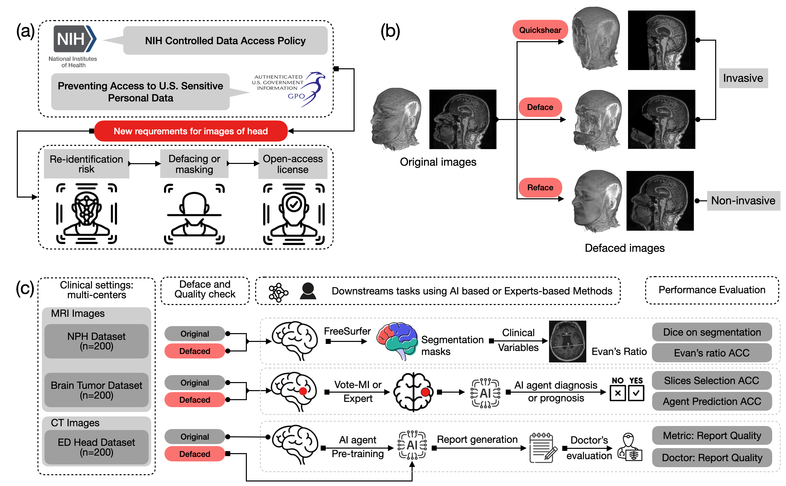

# Balancing Privacy and Performance: The Impact of Facial Defacing on AI in Medical Imaging



The 2025 NIH Data Management and Sharing policy mandates facial anonymization for publicly shared medical imaging data, prompting concerns about potential degradation of AI model performance. We systematically evaluated three representative defacing algorithms, two invasive (QuickShear, Deface) and one geometry-preserving, non-invasive method (Reface), across MRI and CT datasets from 600 subjects. Model performance was assessed across complementary clinical tasks: (1) brain segmentation and Evans ratio measurement in MRI of normal pressure hydrocephalus (NPH), (2) representative slice selection and diagnostic reasoning for brain tumor MRI using vision–language models (VLMs), and (3) automated report generation from emergency department CT head scans via VLMs. Invasive defacing substantially impaired segmentation accuracy, diagnostic precision, and report fidelity, whereas the non-invasive Reface approach preserved model performance with minimal deviation from original data. These findings quantify the privacy–utility trade-off introduced by facial defacing and underscore the importance of non-invasive, geometry-preserving anonymization techniques to ensure both patient privacy and AI model reproducibility under the emerging NIH data-sharing mandate.

## Datasets Description
This retrospective study was approved by the Institutional Review Boards of Johns Hopkins University (IRB00318113 for the NPH MRI dataset, IRB00452757 for the Brain Tumor MRI dataset, and IRB00424745 for the ED head CT dataset) with a waiver of informed consent. A data transfer agreement with the University of Pennsylvania (identification number: 73481-00) was also established for the Brain Tumor MRI dataset.


### Data Structure

| Type                      | No. (ALL)   | No. (Include) | Format |
| --------------------------| ------------| ------------- | -------|
| NPH MRI Dataset           | 534         | 200           | DICOM  |
| Brain Tumor MRI Dataset   | 2453        | 200           | NiFTI  |
| ED CT Head Dataset        | 33,128      | 200           | DICOM  |

## Deface methods and implementation details

### Quickshear

**Version:** `v1.1.0` (May 23, 2017)  
**Repository:** [nipy/quickshear](https://github.com/nipy/quickshear)

Quickshear removes facial features by defining a **shearing plane** separating the brain from the face and setting all voxels anterior to the plane to zero.  
The plane is derived from a brain mask (e.g., via BET) and propagated across all sagittal slices.  
A tunable buffer controls how aggressively the face is removed.

#### Installation
```
pip install quickshear
# or clone
git clone https://github.com/nipy/quickshear
```

### Deface (Deep Learning)
**Version:** ver.0.2 (latest commit, November 2020)
**Repository:** yeonuk-Jeong/Defacer

Defacer is the first open-source deep learning–based anonymization tool.
It uses a 3D attention-gated U-Net trained on 240 whole-head MRIs from ADNI to detect and modify facial features (eyes, ears, nose, mouth) while preserving the brain.
Validated on 100 OASIS MRIs.

#### Installation
```
git clone https://github.com/yeonuk-Jeong/Defacer
cd Defacer
pip install tensorflow==1.14 keras==2.2.4 nibabel
```

### Reface (mri_reface)
**Version:** v0.2, v0.3, and latest v0.3.5 (Dec 2024)
**Repository:** mri_reface on NITRC

Reface replaces (rather than removes) facial voxels.
An average face is registered to the subject using ANTs or NiftyReg, and the warped face is blended into the image with bias correction and intensity harmonization.
This preserves brain structures while anonymizing facial identity.

#### Installation
```
wget https://www.nitrc.org/frs/download.php/13678/mri_reface_v0.3.5_Linux.zip
unzip mri_reface_v0.3.5_Linux.zip
export PATH=$PATH:$PWD/mri_reface_v0.3.5
```

## Downstream tasks

### Brain Sementations

**Freesurfer:** [Freesurfer](https://github.com/freesurfer/freesurfer)

**SLANT:** [SLANT](https://github.com/MASILab/SLANTbrainSeg)

